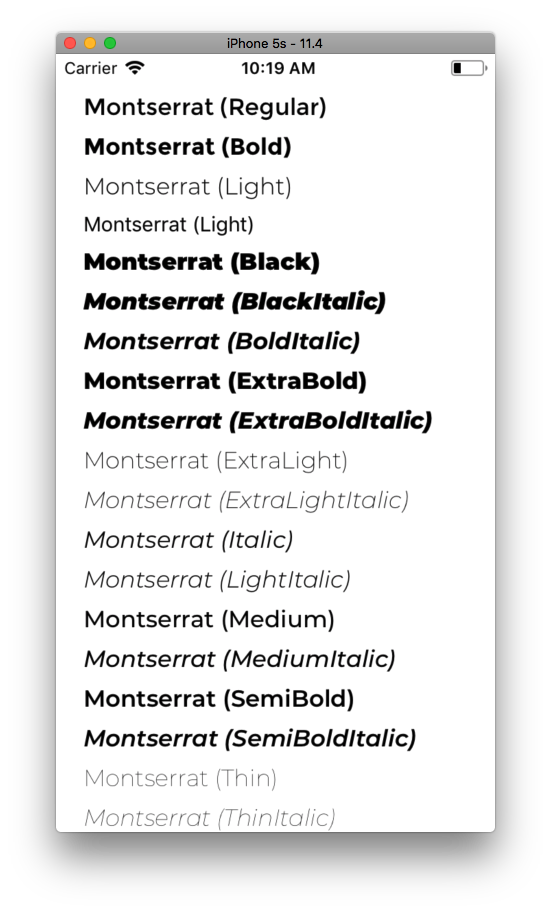

Montserrat
==========

[](https://travis-ci.org/CocoaPods-Fonts/Montserrat)

The old posters and signs in the traditional neighborhood of Buenos Aires
called Montserrat inspired me to design a typeface that rescues the beauty of
urban typography from the first half of the twentieth century. The goal is to
rescue what is in Montserrat and set it free, under a free, libre and open
source license, the SIL Open Font License.

As urban development changes this place, it will never return to its original
form and loses forever the designs that are so special and unique. To draw the
letters, I rely on examples of lettering in the urban space. Each selected
example produces its own variants in length, width and height proportions, each
adding to the Montserrat family. The old typographies and canopies are
irretrievable when they are replaced.

There are other revivals, but those do not stay close to the originals. The
letters that inspired this project have work, dedication, care, color,
contrast, light and life, day and night! These are the types that make the city
look so beautiful.



## Usage

```objective-c
#import <OpenSans/UIFont+Montserrat.h>

@implementation MontserratViewController

- (void)viewDidLoad {
    [super viewDidLoad];

    self.montserratLabel.font = [UIFont montserratFontOfSize:17.0];
    self.montserratBoldLabel.font = [UIFont montserratBoldFontOfSize:17.0];
    self.montserratLightLabel.font = [UIFont montserratLightFontOfSize:17.0];
    self.montserratBlackLabel.font = [UIFont montserratBlackFontOfSize:17.0];
    self.montserratBlackItalicLabel.font = [UIFont montserratBlackItalicFontOfSize:17.0];
    self.montserratBoldItalicLabel.font = [UIFont montserratBoldItalicFontOfSize:17.0];
    self.montserratExtraBoldLabel.font = [UIFont montserratExtraBoldFontOfSize:17.0];
    self.montserratExtraBoldItalicLabel.font = [UIFont montserratExtraBoldItalicFontOfSize:17.0];
    self.montserratExtraLightLabel.font = [UIFont montserratExtraLightFontOfSize:17.0];
    self.montserratExtraLightItalicLabel.font = [UIFont montserratExtraLightItalicFontOfSize:17.0];
    self.montserratItalicLabel.font = [UIFont montserratItalicFontOfSize:17.0];
    self.montserratLightItalicLabel.font = [UIFont montserratLightItalicFontOfSize:17.0];
    self.montserratMediumLabel.font = [UIFont montserratMediumFontOfSize:17.0];
    self.montserratMediumItalicLabel.font = [UIFont montserratMediumItalicFontOfSize:17.0];
    self.montserratSemiBoldLabel.font = [UIFont montserratSemiBoldFontOfSize:17.0];
    self.montserratSemiBoldItalicLabel.font = [UIFont montserratSemiBoldItalicFontOfSize:17.0];
    self.montserratThinLabel.font = [UIFont montserratThinFontOfSize:17.0];
    self.montserratThinItalicLabel.font = [UIFont montserratThinItalicFontOfSize:17.0];
}

@end
```

## Installation

This is a CocoaPod and you can install it with the following:

```ruby
pod 'Montserrat'
```

## License

Julieta Ulanovsky (julieta.ulanovsky@gmail.com) owns the
copyright to the Montserrat font and it is licensed under
[SIL Open Font License, 1.1](OFL.txt).

